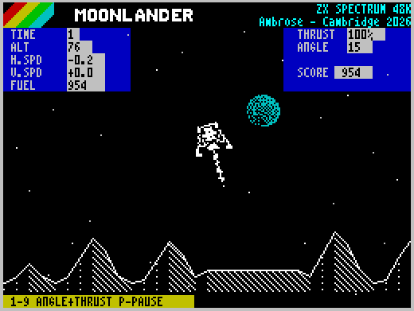

# Lunar Lander for the ZX Spectrum
A 2026 version of Lunar Lander for the 48K ZX Spectrum.

To Play
Drop the LLander.tap into any ZX Spectrum emulator or real hardware.
e.g. https://jsspeccy.zxdemo.org/

Built using z88dk C Compiler 
- With Code assistance by CoPilot

Instructions to compile:
- Install Z88DK - make sure its in path
- Install Fuse Spectrum Emulator - make sure its in path
- Restart Visual Studio Code if it was running so it can pick up the path changes
- Open folder 
- Ctrl+Shift+B = Build
- F5 to Build & Run

1-9 select an angle and fire the thruster in that direction:
1=-45, 2=-30, 3=-15, 4=-5, 5=0, 6=5, 7=15, 8=30, 9=45 degrees.
0 returns the lander to the upright landing angle.
Space fires in the direction of the last angle selected with 1-9.
P pauses the flight; Q quits.

Land upright on the landing pad with low horizontal and vertical speed.

Ambrose Clarke September 2026 as a Demo for Tog(Ireland) table at Cambridge Retro Day 2026

